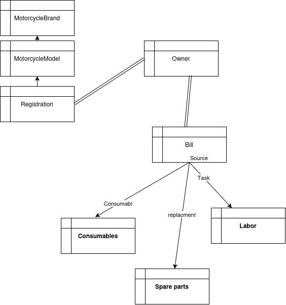

# TDC developpment

Je veux développer un projet avec react.
mobile first avec burger menu

dev avec ubuntu, vscode, typscript
tout le code et les commentaires du code seront en anglais mais les explication sont en francais
pas d'utilisation d'ORM

```
npm create vite@latest ./
```

# tdc

see doc requierement /tdc/doc/01_Opportunity Study.md

- basics :
  - mecano : 1 utilisateur exécutant des réparations
  - part management : 2 utilisateur gestion des pièces
  - billing : 3 utilisateur : facturation client
  - task cost : gestion du cout des tâches
  - quotes : devis client.
  - CRM

- admin
  - payroll 4 user : emission des salaires
  - trial : balance comptable

# developpement

## mobile first

- burgerMenu

## design

MVC.

```
postgres-demo/
├── server/
│   ├── src/
│   │   ├── config/
│   │   │   ├── rateConfig.json
│   │   │   └── rateMultipliers.json
│   │   ├── routes/
│   │   │   ├── motorcycleBrand.routes.ts
│   │   │   ├── registration.routes.ts
│   │   │   ├── hourlyRate.routes.ts
│   │   │   ├── invoice.routes.ts
│   │   │   ├── owner.routes.ts
│   │   │   ├── labor.routes.ts
│   │   │   ├── consumable.routes.ts
│   │   │   ├── sparePart.routes.ts
│   │   │   ├── rateConfig.routes.ts
│   │   │   └── motorcycleModel.routes.ts
│   │   ├── controllers/
│   │   │   ├── motorcycleBrand.controller.ts
│   │   │   ├── registration.controller.ts
│   │   │   ├── hourlyRate.controller.ts
│   │   │   ├── invoice.controller.ts
│   │   │   ├── owner.controller.ts
│   │   │   ├── labor.controller.ts
│   │   │   ├── consumable.controller.ts
│   │   │   ├── sparePart.controller.ts
│   │   │   ├── rateConfig.controller.ts
│   │   │   └── motorcycleModel.controller.ts
│   │   ├── services/
│   │   │   ├── motorcycleBrand.service.ts
│   │   │   ├── registration.service.ts
│   │   │   ├── hourlyRate.service.ts
│   │   │   ├── invoice.service.ts
│   │   │   ├── owner.service.ts
│   │   │   ├── labor.service.ts
│   │   │   ├── consumable.service.ts
│   │   │   ├── sparePart.service.ts
│   │   │   ├── rateConfig.service.ts
│   │   │   ├── motorcycleModel.service.ts
│   │   ├── repositories/
│   │   │   ├── motorcycleBrand.repository.ts
│   │   │   ├── registration.repository.ts
│   │   │   ├── hourlyRate.repository.ts
│   │   │   ├── invoice.repository.ts
│   │   │   ├── owner.repository.ts
│   │   │   ├── labor.repository.ts
│   │   │   ├── consumable.repository.ts
│   │   │   ├── sparePart.repository.ts
│   │   │   ├── motorcycleModel.repository.ts
│   │   ├── models/
│   │   │   ├── motorcycleBrand.model.ts
│   │   │   ├── registration.model.ts
│   │   │   ├── hourlyRate.model.ts
│   │   │   ├── invoice.model.ts
│   │   │   ├── owner.model.ts
│   │   │   ├── registration.model.ts
│   │   │   ├── labor.model.ts
│   │   │   ├── consumable.model.ts
│   │   │   ├── sparePart.model.ts
│   │   │   ├── motorcycleModel.model.ts
│   │   └── types/
│   │       ├── motorcycleBrand.types.ts
│   │       ├── registration.types.ts
│   │       ├── hourlyRate.types.ts
│   │       ├── invoice.types.ts
│   │       ├── owner.types.ts
│   │       ├── labor.types.ts
│   │       ├── consumable.types.ts
│   │       ├── sparePart.types.ts
│   │       ├── rateConfig.types.ts
│   │       ├── motorcycleModel.types.ts
│   └── server.ts
├── client/
│   ├── src/
│   │   ├── i18n/
│   │   │   ├── index.ts
│   │   │   ├── config.ts
│   │   │   └── locales/
│   │   │       ├── en/
│   │   │       │   ├── common.json
│   │   │       │   ├── navigation.json
│   │   │       │   ├── labor.json
│   │   │       │   ├── sparePart.json
│   │   │       │   ├── owner.json
│   │   │       │   └── invoice.json
│   │   │       ├── vi/
│   │   │       │   ├── common.json
│   │   │       │   ├── navigation.json
│   │   │       │   ├── labor.json
│   │   │       │   └── ...
│   │   │       └── fr/
│   │   │           ├── common.json
│   │   │           ├── navigation.json
│   │   │           └── ...
│   │   ├── common/
│   │   │   ├── motorcycleBrand.common.ts
│   │   │   ├── registration.common.ts
│   │   │   ├── hourlyRate.common.ts
│   │   │   ├── invoice.common.ts
│   │   │   ├── owner.common.ts
│   │   │   ├── labor.common.ts
│   │   │   ├── consumable.common.ts
│   │   │   ├── sparePart.common.ts
│   │   │   ├── motorcycleModel.common.ts
│   │   ├── types/
│   │   │   ├── motorcycleBrand.types.ts
│   │   │   ├── registration.types.ts
│   │   │   ├── hourlyRate.types.ts
│   │   │   ├── invoice.types.ts
│   │   │   ├── owner.types.ts
│   │   │   ├── labor.types.ts
│   │   │   ├── consumable.types.ts
│   │   │   ├── sparePart.types.ts
│   │   │   ├── motorcycleModel.types.ts
│   │   ├── styles/
│   │   │   ├── motorcycleBrand.style.ts
│   │   │   ├── registration.style.ts
│   │   │   ├── hourlyRate.style.ts
│   │   │   ├── invoice.style.ts
│   │   │   ├── owner.style.ts
│   │   │   ├── consumable.style.ts
│   │   │   ├── labor.style.ts
│   │   │   ├── sparePart.style.ts
│   │   │   ├── motorcycleModel.style.ts
│   │   ├── services/
│   │   │   ├── motorcycleBrand.service.ts
│   │   │   ├── registration.service.ts
│   │   │   ├── hourlyRate.service.ts
│   │   │   ├── invoice.service.ts
│   │   │   ├── owner.service.ts
│   │   │   ├── consumable.service.ts
│   │   │   ├── labor.service.ts
│   │   │   ├── sparePart.service.ts
│   │   │   ├── motorcycleModel.service.ts
│   │   ├── components/
│   │   │   ├── Layout
│   │   │   ├── Navigation
│   │   │   ├── UI
│   │   │   ├── LaborEdit.tsx
│   │   │   └── MotorcycleBrandList.tsx
│   │   └── pages/
│   │       ├── Home.tsx
│   │       ├── About.tsx
│   │       ├── Test.tsx
│   │       ├── motorcycleModel.page.tsx
│   │       ├── registration.page.tsx
│   │       ├── owner.page.tsx
│   │       ├── ownerAdm.page.tsx
│   │       ├── invoice.page.tsx
│   │       ├── invoiceAdm.page.tsx
│   │       ├── labor.page.tsx
│   │       ├── laborAdm.page.tsx
│   │       ├── consumable.page.tsx
│   │       ├── consumableAdm.page.tsx
│   │       ├── sparePart.page.tsx
│   │       ├── sparePartAdm.page.tsx
│   │       └── MotorcycleBrand.page.tsx
├─── database.sql
│   ├── crbleTableBranda/
└── admClient/              # Nouvelle application admin
    ├── public/
    │   └── index.html
    ├── src/
    │   ├── assets/
    │   ├── components/
    │   │   ├── Layout/
    │   │   │   ├── AdminLayout.tsx
    │   │   │   ├── Sidebar.tsx
    │   │   │   └── Header.tsx
    │   │   ├── Dashboard/
    │   │   │   ├── StatsCard.tsx
    │   │   │   └── RecentActivity.tsx
    │   │   ├── Tables/
    │   │   │   ├── DataTable.tsx
    │   │   │   └── TableActions.tsx
    │   │   ├── Forms/
    │   │   │   ├── LaborForm.tsx
    │   │   │   ├── BrandForm.tsx
    │   │   │   └── OwnerForm.tsx
    │   │   └── common/
    │   │       ├── Button.tsx
    │   │       ├── Input.tsx
    │   │       ├── Select.tsx
    │   │       └── Modal.tsx
    │   ├── pages/
    │   │   ├── Dashboard.tsx
    │   │   ├── Labor/
    │   │   │   ├── LaborList.tsx
    │   │   │   └── LaborEdit.tsx
    │   │   ├── Brands/
    │   │   │   ├── BrandList.tsx
    │   │   │   └── BrandEdit.tsx
    │   │   ├── Owners/
    │   │   │   ├── OwnerList.tsx
    │   │   │   └── OwnerEdit.tsx
    │   │   ├── Invoices/
    │   │   │   ├── InvoiceList.tsx
    │   │   │   └── InvoiceEdit.tsx
    │   │   └── Settings/
    │   │       ├── RateConfig.tsx
    │   │       └── UserManagement.tsx
    │   ├── services/
    │   │   ├── api.ts
    │   │   ├── labor.service.ts
    │   │   ├── brand.service.ts
    │   │   ├── owner.service.ts
    │   │   └── invoice.service.ts
    │   ├── types/
    │   │   ├── labor.types.ts
    │   │   ├── brand.types.ts
    │   │   ├── owner.types.ts
    │   │   └── invoice.types.ts
    │   ├── styles/
    │   │   ├── theme.ts
    │   │   └── GlobalStyles.ts
    │   ├── hooks/
    │   │   ├── useAuth.ts
    │   │   └── useApi.ts
    │   ├── utils/
    │   │   ├── formatters.ts
    │   │   └── validators.ts
    │   ├── App.tsx
    │   ├── main.tsx
    │   └── vite-env.d.ts
    ├── index.html
    ├── package.json
    ├── tsconfig.json
    ├── tsconfig.node.json
    ├── vite.config.ts
    └── .env
```

### database

PostgreSQL

### schema

client
vehicule

# technique

## postgresql

- comment se connecter à la base
- créer l'utilisateur tdc2026 (utilisateur system)
- créer la basede donnée tdc2026
- créer la table region par une requette SQL
- faire une API REST pour CRUD de cette table.

# tdc



# I18N

## structure des fichiers

```
client/
├── src/
│   ├── i18n/
│   │   ├── index.ts
│   │   ├── config.ts
│   │   └── locales/
│   │       ├── en/
│   │       │   ├── common.json
│   │       │   ├── navigation.json
│   │       │   ├── labor.json
│   │       │   ├── sparePart.json
│   │       │   ├── owner.json
│   │       │   └── invoice.json
│   │       ├── vi/
│   │       │   ├── common.json
│   │       │   ├── navigation.json
│   │       │   ├── labor.json
│   │       │   └── ...
│   │       └── fr/
│   │           ├── common.json
│   │           ├── navigation.json
│   │           └── ...
│   ├── components/
│   │   ├── LanguageSelector.tsx
│   │   └── ...
│   └── hooks/
│       └── useLanguage.ts
└── ...

```

# API REST

## 📋 API Endpoints Summary
Method URL Description
GET /api/rate-config Get full configuration
PUT /api/rate-config Update full configuration
GET /api/rate-config/base-rate Get base rate
PUT /api/rate-config/base-rate Update base rate
GET /api/rate-config/rate-types Get all rate types
GET /api/rate-config/rate-types/:code Get rate type by code
POST /api/rate-config/rate-types Create rate type
PUT /api/rate-config/rate-types/:code Update rate type
DELETE /api/rate-config/rate-types/:code Delete rate type
GET /api/rate-config/skill-levels Get all skill levels
POST /api/rate-config/skill-levels Create skill level
PUT /api/rate-config/skill-levels/:code Update skill level
DELETE /api/rate-config/skill-levels/:code Delete skill level
GET /api/rate-config/service-categories Get all service categories
POST /api/rate-config/service-categories Create service category
PUT /api/rate-config/service-categories/:code Update service category
DELETE /api/rate-config/service-categories/:code Delete service category
GET /api/rate-config/brand-multipliers Get brand multipliers
GET /api/rate-config/rounding-rules Get rounding rules
GET /api/rate-config/minimum-charge Get minimum charge rules

# déploiement

Netlify

Une excellente alternative, aussi réputée pour sa simplicité .

    Méthode : Glissez-déposez votre dossier dist directement sur l'interface web, ou connectez votre dépôt GitHub.

    Configuration : Configurez la commande de build (npm run build) et le dossier de publication (dist) si ce n'est pas automatique.

    Avantages : Fonctionnalités supplémentaires comme les "Forms" (gestion de formulaires sans backend) et les "Functions" (serverless).

    Prix : Free tier très complet.

# définition d'une tâche

- id
- code (unique) = rateTypes[0,2]skillLevels[0,2]serviceCategories[0,2]-$count
- libelle
- rateTypes
- skillLevels
- serviceCategories
- brandMultipliers

# facture

Zones d'une facture de travaux

1. EN-TÊTE DE LA FACTURE (Zone Informations générales)
   Champ Description Exemple
   Numéro de facture Identifiant unique, format INV-YYYY-XXXXX INV-2025-00042
   Date d'émission Date de création de la facture 15/03/2025
   Date d'échéance Date limite de paiement 15/04/2025
   Statut brouillon, en attente, payée, partiellement payée, en retard, annulée en attente
2. INFORMATIONS CLIENT
   Champ Description Source
   Nom du client Nom complet Table owners
   Téléphone Contact principal Table owners
   Email Pour envoi facture Table owners
   Adresse Si nécessaire Table owners
3. INFORMATIONS VÉHICULE
   Champ Description Source
   Plaque d'immatriculation Identifiant unique Table registrations
   Marque Honda, Yamaha, etc. Table motorcycle_brands
   Modèle CB 650 R, MT-07, etc. Table motorcycle_models
   Année Année de fabrication Table registrations
   Kilométrage Au moment de l'intervention Saisie manuelle
   Couleur Optionnel Table registrations
4. DÉTAIL DES TRAVAUX (Zone principale)
   4.1 Main d'œuvre (Labor)
   Champ Description Exemple
   Description Nature de l'intervention Vidange moteur
   Heures Temps passé (par 0.25h) 0.5 h
   Taux horaire Tarif appliqué 350 000 VND/h
   Montant Heures × Taux 175 000 VND
   4.2 Pièces détachées (Spare Parts)
   Champ Description Exemple
   Nom de la pièce Désignation Filtre à huile
   Référence Code OEM ou interne 15410-MFJ-D01
   Quantité Nombre d'unités 1
   Prix unitaire Prix HT 150 000 VND
   Montant Qté × Prix 150 000 VND
   4.3 Consommables (Consumables)
   Champ Description Exemple
   Nom Produit consommé Huile moteur 10W40
   Quantité Volume / nombre 3 litres
   Unité litre, ml, kg, pièce litre
   Prix unitaire Prix HT 120 000 VND
   Montant Qté × Prix 360 000 VND
5. RÉCAPITULATIF FINANCIER
   Champ Calcul Exemple
   Sous-total main d'œuvre Σ(main d'œuvre) 175 000 VND
   Sous-total pièces Σ(pièces) 150 000 VND
   Sous-total consommables Σ(consommables) 360 000 VND
   Sous-total HT Somme des sous-totaux 685 000 VND
   TVA (10%) Sous-total HT × 10% 68 500 VND
   TOTAL TTC Sous-total HT + TVA 753 500 VND
6. SUIVI DES PAIEMENTS
   Champ Description Exemple
   Montant déjà payé Somme des acomptes 400 000 VND
   Reste à payer Total TTC - Déjà payé 353 500 VND
   Historique des paiements Liste des versements 15/03: 200k, 20/03: 200k
7. INFORMATIONS GARAGE
   Champ Description
   Nom du garage Votre enseigne
   Adresse Complète
   Téléphone Contact
   Email Pour facturation électronique
   SIRET / Tax code Identification légale
   Numéro de licence Si requis
8. INFORMATIONS LÉGALES
   Champ Description
   Conditions de paiement "Net à 30 jours", etc.
   Pénalités de retard Ex: 1% par mois
   Garantie Durée sur les pièces/main d'œuvre
   Mentions obligatoires Selon législation locale

# Architecture typique client

```
┌─────────────────────────────────────────────────────────────┐
│                      FRONTEND (React)                        │
│                                                              │
│  CreateOwnerDto = { firstName, lastName, phoneNumber }      │
│         ↓                                                    │
│         POST /api/owners                                     │
└────────────────────────┬────────────────────────────────────┘
                         │
                         ▼
┌─────────────────────────────────────────────────────────────┐
│                      BACKEND (API)                           │
│                                                              │
│  1. Reçoit CreateOwnerDto                                    │
│  2. Valide les données                                       │
│  3. Ajoute les champs manquants (createdAt, createdBy)      │
│  4. Insère dans la base de données                          │
│  5. Retourne OwnerResponseDto (avec id, dates)              │
└─────────────────────────────────────────────────────────────┘
```

# Architecture typique serveur

```
┌─────────────────────────────────────────────────────────────┐
│                      ROUTES (Couche Présentation)            │
│  - Définit les endpoints API                                 │
│  - Gère les méthodes HTTP (GET, POST, PUT, DELETE)          │
│  - Valide les paramètres d'URL                              │
└────────────────────────┬────────────────────────────────────┘
                         │
                         ▼
┌─────────────────────────────────────────────────────────────┐
│                   CONTROLLER (Couche Contrôleur)             │
│  - Reçoit les requêtes HTTP                                  │
│  - Extrait et valide les données (body, params, query)      │
│  - Formate la réponse                                        │
│  - Gère les erreurs HTTP (404, 500, etc.)                   │
└────────────────────────┬────────────────────────────────────┘
                         │
                         ▼
┌─────────────────────────────────────────────────────────────┐
│                    SERVICE (Couche Métier)                   │
│  - Contient la logique métier                                │
│  - Valide les règles d'affaires                              │
│  - Orchestre les opérations                                  │
│  - Ne parle pas directement à la base de données            │
└────────────────────────┬────────────────────────────────────┘
                         │
                         ▼
┌─────────────────────────────────────────────────────────────┐
│                  REPOSITORY (Couche Accès Données)           │
│  - Interagit directement avec la base de données            │
│  - Exécute les requêtes SQL                                  │
│  - Ne contient PAS de logique métier                        │
│  - Transforme les données DB en objets TypeScript           │
└─────────────────────────────────────────────────────────────┘


```

# entité Task

## Résumé des endpoints

Méthode URL Description
GET /api/task-catalog Liste paginée (filtres : brandId, skillLevel, isActive, search)
GET /api/task-catalog/code/:code Récupère par code unique
GET /api/task-catalog/:id Récupère par ID
POST /api/task-catalog Crée une tâche
PUT /api/task-catalog/:id Met à jour une tâche
DELETE /api/task-catalog/:id Supprime une tâche

Le CRUD est complet, respecte l’architecture fonctionnelle, et est prêt à être intégré.

# installation de police pour les caractères vietnamien

```
# Exemple pour Be Vietnam Pro
nok ==>npm install @fontsource/be-vietnam-pro

sol 2
télécher ttf sur google font
copier le ttf dans src/assets/fonts
faire des import
import regularFont from "../../assets/fonts/BeVietnamPro-Regular.ttf";
import italicFont from "../../assets/fonts/BeVietnamPro-Italic.ttf";
```

#Besoin

invoice
invoiceInfo => affiche la liste des invoice
invoiceLine
garage
vehicle
vehicleInfo
